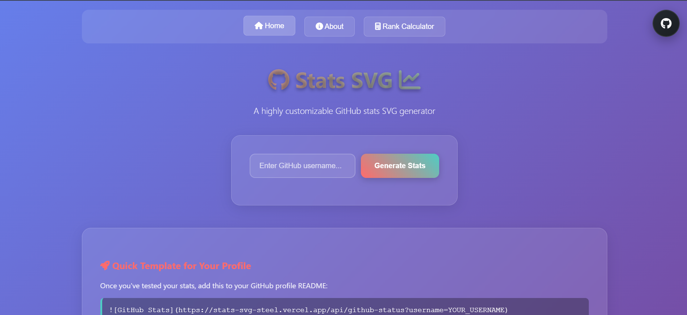

# <i class="fa-brands fa-github fa-spin"></i>Stats SVG<i class="fa-solid fa-chart-line fa-fade"></i>
*A highly customizable stats SVG generator for GitHub and LeetCode*


This project generates visually appealing, highly customizable SVG images displaying both GitHub and LeetCode user statistics. It's designed to be embedded in GitHub profiles or other web pages to showcase your coding journey across multiple platforms.

## 🚀 Try It Out!

Want to see your GitHub and LeetCode stats? Open the link below and enter your username to generate your personalized stats SVG for both platforms!

<a href="https://git-stats.harikrishnan.tech/tryout" target="_blank">Stats-SVG</a>
```
https://git-stats.harikrishnan.tech/tryout
```


**From the UI, you can:**
- 🔍 **View GitHub Stats**: Enter your GitHub username to see repositories, commits, stars, and language usage
- 💡 **View LeetCode Stats**: Enter your LeetCode username to see problems solved, ranking, and badges
- 🎨 **Try Both**: Test different usernames and customization options for both platforms
- 📋 **Get Embed Code**: Copy the generated markdown for your profile

### 📋 Quick Templates for Your Profile

Once you've tested your stats, add these to your GitHub profile README:

**For GitHub Stats:**
```markdown

```

**For LeetCode Stats:**
```markdown

```

**Replace the usernames with your actual GitHub and LeetCode usernames**

### 🎯 Example Usage

Here's how both stats look together:

**GitHub Stats:**


**LeetCode Stats:**


## ✨ Features

### GitHub Stats
- 📊 **Real-time Data**: Fetches live GitHub user data using the GitHub GraphQL API
- 📈 **Comprehensive Metrics**: Displays commits, language usage, repositories, stars, and more
- 🔄 **Consistent Algorithm**: Uses the same ranking and language calculation algorithm as [anuraghazra/github-readme-stats](https://github.com/anuraghazra/github-readme-stats) for standardized results

### LeetCode Stats
- 🧩 **Problem Solving Metrics**: Shows total problems solved, acceptance rate, and difficulty breakdown
- 🏆 **Ranking Information**: Displays your current ranking and contest participation
- 📊 **Progress Tracking**: Visual representation of your coding journey on LeetCode

### General Features
- 🎨 **Highly Customizable**: Generate SVG images with custom color schemes, configurations, and animated elements
- ⚡ **Fast & Lightweight**: Optimized SVG generation for quick loading
- 🌈 **Multiple Themes**: Support for various color themes and styles
- 🔧 **Interactive UI**: Try out both GitHub and LeetCode stats with live preview

## 🛠️ Deployment

Since the GitHub API only allows 5k requests per hour, the public API provided by this repo could possibly hit the rate limiter. You can host your own instance of this repo on Vercel to avoid rate limiting issues.

> [!IMPORTANT]
> This project requires a GitHub Personal Access Token (PAT) to access private repositories. For LeetCode stats, the service uses public LeetCode GraphQL API. Refer to the Manual Deployment section below for instructions on obtaining the GitHub PAT.

<details>
<summary><b>🚀 Manual Deployment</b></summary>

### 1. Fork and Prepare the Repository
1. **Fork this repository** to your GitHub account
2. **[Create a Personal Access Token (PAT)](https://github.com/settings/tokens/new)**
   - Set the token name (e.g., "stats-svg")
   - Select scopes: `repo` and `user`
   - Copy the generated token (you won't see it again so save it!)

### 2. Deploy to Vercel
1. Visit [Vercel](https://vercel.com/)
2. Sign up/Log in with your GitHub account
3. From your Vercel dashboard:
   - Click `Add New...` → `Project`
   - Select the forked repository
   - Click `Import`

### 3. Configure Environment Variables
1. In the project configuration screen:
   - Expand the `Environment Variables` section
   - Add a new variable:
     - **Name**: `GITHUB_TOKEN`
     - **Value**: Your GitHub PAT from step 1
2. Click `Deploy`

### 4. Using Your Instance
- Once deployed, Vercel will provide you with a domain (e.g., `your-project.vercel.app`)
- You can use your instance by replacing the domain in the API URLs:
  ```
  https://your-project.vercel.app/api/github-status?username=YOUR_GITHUB_USERNAME
  https://your-project.vercel.app/api/leetcode-status?username=YOUR_LEETCODE_USERNAME
  ```

### 🔧 Troubleshooting
- For deployment issues, check Vercel's deployment logs
- For bugs or feature requests, open an issue in this repository
- Ensure your GitHub token has the correct permissions
- LeetCode stats are fetched from public API, no additional tokens required

</details>

## 🎨 Customization Options

You can customize the appearance of both GitHub and LeetCode SVGs by modifying query parameters or the `config.js` file.

### Available Endpoints
- `/api/github-status` - GitHub user statistics
- `/api/leetcode-status` - LeetCode user statistics

## 🌟 Contributing

Contributions are welcome! Please feel free to submit a Pull Request. For major changes, please open an issue first to discuss what you would like to change.

### Areas for Contribution
- 🎨 New themes and color schemes
- 📊 Additional statistics and metrics
- 🔧 Performance improvements
- 🐛 Bug fixes and optimizations
- 📱 Mobile responsiveness improvements